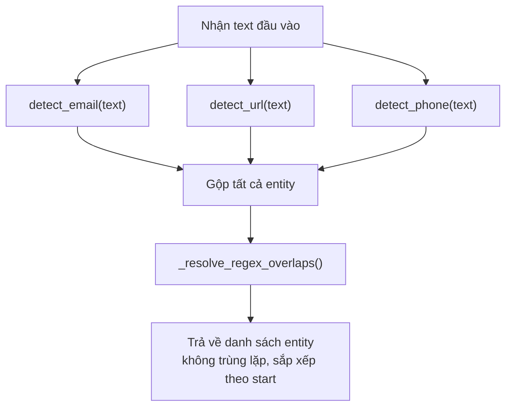

# `regex_detector` Algorithm Summary

## 1. Mục tiêu (Goal)

Module `regex_detector` có nhiệm vụ **phát hiện các thực thể PII (Personally Identifiable Information) có cấu trúc** trong văn bản thô bằng biểu thức chính quy (regex) thuần Python. Cụ thể, module nhận diện ba loại thực thể:

| Loại | Mô tả |
|------|--------|
| **EMAIL** | Địa chỉ email (ví dụ: `john@gmail.com`) |
| **PHONE** | Số điện thoại (ví dụ: `+84 912 345 678`, `0912-345-678`) |
| **URL** | Đường dẫn web (ví dụ: `https://example.com`, `www.example.com`) |

Module không sử dụng machine learning hay thư viện bên ngoài — chỉ dùng module `re` của Python standard library.

---

## 2. Đầu vào và Đầu ra (Inputs and Outputs)

### Đầu vào

| Tham số | Kiểu dữ liệu | Mô tả |
|---------|---------------|--------|
| `text` | `str` | Chuỗi văn bản thô cần phân tích |

### Đầu ra

| Trả về | Kiểu dữ liệu | Mô tả |
|--------|---------------|--------|
| Danh sách entity | `list[dict[str, Any]]` | Mỗi phần tử là một dict chứa thông tin entity |

Mỗi entity dict có cấu trúc:

```python
{
    "type": str,    # "EMAIL" | "PHONE" | "URL"
    "text": str,    # Nội dung thực thể đã trích xuất
    "start": int,   # Vị trí bắt đầu (0-indexed, inclusive)
    "end": int,     # Vị trí kết thúc (0-indexed, exclusive)
}
```

> [!NOTE]
> Chỉ số `start` và `end` tuân theo quy ước slice của Python: `text[start:end]` sẽ trả về đúng nội dung entity.

---

## 3. Luồng xử lý tổng quan (High-Level Processing Flow)



**Tóm tắt luồng:**

1. Chạy **song song** (về logic, không phải threading) ba detector riêng biệt cho EMAIL, URL, PHONE.
2. Gộp kết quả thành một danh sách chung.
3. Giải quyết trùng lặp (overlap) theo thứ tự ưu tiên `EMAIL > URL > PHONE`.
4. Sắp xếp kết quả theo vị trí `start` tăng dần và trả về.

---

## 4. Thuật toán chi tiết (Detailed Algorithm)

### Bước 1: Phát hiện EMAIL — `detect_email(text)`

1. Duyệt tất cả match của `EMAIL_PATTERN` trong `text` bằng `finditer()`.
2. Với mỗi match:
   - Lấy `start`, `end` từ match object.
   - Gọi `_strip_trailing_punctuation()` để loại bỏ dấu câu cuối (`.`, `,`, `;`, `:`, `!`, `?`, `)`, `]`, `}`, `"`, `'`).
   - Nếu chuỗi entity sau khi strip rỗng → bỏ qua.
   - Thêm entity dict `{type: "EMAIL", text, start, end}` vào kết quả.

### Bước 2: Phát hiện URL — `detect_url(text)`

1. Duyệt tất cả match của `URL_PATTERN` trong `text`.
2. Với mỗi match:
   - Strip trailing punctuation.
   - **Cân bằng ngoặc đơn**: Nếu URL kết thúc bằng `)` nhưng không chứa `(` → lặp loại bỏ `)` cuối (xử lý trường hợp URL nằm trong ngoặc văn bản).
   - Nếu entity rỗng → bỏ qua.
   - Thêm entity dict `{type: "URL", text, start, end}`.

### Bước 3: Phát hiện PHONE — `detect_phone(text)`

Đây là detector phức tạp nhất với nhiều bước validation:

1. **Tiền xử lý loại trừ**: Tìm tất cả span của EMAIL và URL trước để loại trừ.
2. Duyệt tất cả match của `PHONE_PATTERN`.
3. Với mỗi match:
   - **Kiểm tra overlap**: Nếu match trùng với bất kỳ span EMAIL/URL nào → bỏ qua.
   - **Trim whitespace**: Loại bỏ khoảng trắng/tab đầu và cuối, cập nhật `start`/`end`.
   - **Strip trailing punctuation**.
   - Nếu entity rỗng → bỏ qua.
   - **Validate số chữ số**: Đếm digits, chỉ giữ nếu `9 ≤ digit_count ≤ 15`.
   - **Guard ký tự liền kề**: Kiểm tra ký tự ngay trước `start` và ngay sau `end` — nếu là chữ/số/`@` → bỏ qua (tránh match một phần token lớn hơn).
   - Thêm entity dict `{type: "PHONE", text, start, end}`.

### Bước 4: Gộp và giải quyết trùng lặp — `_resolve_regex_overlaps(entities)`

1. Sắp xếp entity theo: `(priority, start, -end)`, trong đó `priority = {EMAIL: 0, URL: 1, PHONE: 2}`.
2. Duyệt entity đã sắp xếp, duy trì danh sách `occupied` (các span đã "chiếm"):
   - Nếu entity hiện tại **không overlap** với bất kỳ span nào trong `occupied` → giữ lại, thêm span vào `occupied`.
   - Nếu overlap → loại bỏ.
3. Sắp xếp danh sách kết quả theo `start` tăng dần.

---

## 5. Logic Regex (Regex Logic)

### EMAIL_PATTERN

```regex
[a-zA-Z0-9._%+\-]+@[a-zA-Z0-9\-]+(?:\.[a-zA-Z0-9\-]+)*\.[a-zA-Z]{2,}
```

| Phần | Ý nghĩa |
|------|----------|
| `[a-zA-Z0-9._%+\-]+` | **Local part**: chữ cái, số, dấu chấm, gạch dưới, phần trăm, dấu cộng, gạch ngang |
| `@` | Ký tự phân tách |
| `[a-zA-Z0-9\-]+` | **Domain label đầu tiên** |
| `(?:\.[a-zA-Z0-9\-]+)*` | Các subdomain tùy chọn (phân tách bằng dấu chấm) |
| `\.[a-zA-Z]{2,}` | **TLD**: ít nhất 2 ký tự chữ cái |

**Biên dịch**: Sử dụng `re.compile()` ở mức module (chỉ compile một lần).

### URL_PATTERN

```regex
(?:https?://|www\.)[^\s]+
```

| Phần | Ý nghĩa |
|------|----------|
| `(?:https?://\|www\.)` | Bắt đầu bằng `http://`, `https://`, hoặc `www.` |
| `[^\s]+` | Phần còn lại: mọi ký tự không phải whitespace |

> [!NOTE]
> Pattern này rất rộng (greedy), dấu câu cuối được xử lý bằng hàm strip riêng thay vì trong regex.

### PHONE_PATTERN

```regex
(?<![a-zA-Z0-9@/])(?:\+\d{1,3}[\s.\-]?)?(?:\(?\d{2,5}\)?[\s.\-])?\d{2,5}(?:[\s.\-]\d{2,5}){0,4}(?![a-zA-Z0-9@])
```

| Phần | Ý nghĩa |
|------|----------|
| `(?<![a-zA-Z0-9@/])` | **Negative lookbehind**: không nằm sau chữ/số/`@`/`/` (tránh match giữa email/URL) |
| `(?:\+\d{1,3}[\s.\-]?)?` | **Mã quốc gia** tùy chọn: `+84`, `+1`, v.v. |
| `(?:\(?\d{2,5}\)?[\s.\-])?` | **Mã vùng** tùy chọn: có thể có ngoặc đơn |
| `\d{2,5}` | **Nhóm chữ số đầu tiên**: 2–5 chữ số |
| `(?:[\s.\-]\d{2,5}){0,4}` | **Các nhóm chữ số tiếp theo**: 0–4 nhóm, phân tách bằng khoảng trắng/dấu chấm/gạch ngang |
| `(?![a-zA-Z0-9@])` | **Negative lookahead**: không theo sau bởi chữ/số/`@` |

**Chiến lược**: Pattern rộng cố ý match nhiều, sau đó sử dụng post-validation (đếm số digit, kiểm tra context) để lọc false positive.

---

## 6. Logic quyết định kết quả (Result Decision Logic)

### Khi nào được coi là match?

| Loại | Điều kiện match |
|------|----------------|
| **EMAIL** | Khớp `EMAIL_PATTERN` VÀ entity text không rỗng sau khi strip punctuation |
| **URL** | Khớp `URL_PATTERN` VÀ entity text không rỗng sau khi strip punctuation + cân bằng ngoặc |
| **PHONE** | Khớp `PHONE_PATTERN` VÀ không overlap EMAIL/URL VÀ `9 ≤ digits ≤ 15` VÀ không nằm trong token alphanumeric lớn hơn |

### Khi nào bị loại?

- Entity text rỗng sau xử lý → loại.
- PHONE: digit count ngoài phạm vi [9, 15] → loại.
- PHONE: ký tự liền kề là alphanumeric hoặc `@` → loại.
- PHONE: overlap với span EMAIL hoặc URL → loại.
- Bất kỳ entity nào overlap với entity ưu tiên cao hơn trong bước resolve → loại.

### Confidence / Score

Module **không tính confidence score**. Kết quả là nhị phân: match hoặc không match.

---

## 7. Quy tắc, Heuristics và Ngưỡng (Rules, Heuristics, and Thresholds)

### Thứ tự ưu tiên (Priority)

```
EMAIL (0) > URL (1) > PHONE (2)
```

Khi hai entity overlap nhau, entity có priority thấp hơn (giá trị số nhỏ hơn) được giữ.

### Ngưỡng số chữ số cho PHONE

| Tham số | Giá trị | Lý do |
|---------|---------|-------|
| Tối thiểu digits | **9** | Số điện thoại hợp lệ phải có ít nhất 9 chữ số |
| Tối đa digits | **15** | Giới hạn trên theo tiêu chuẩn E.164 |

### Danh sách ký tự trailing punctuation (Blacklist)

```python
_TRAILING_PUNCT = {".", ",", ";", ":", "!", "?", ")", "]", "}", '"', "'"}
```

Các ký tự này bị loại bỏ khỏi cuối (và đôi khi đầu) match, vì chúng thường là dấu câu của văn bản bao quanh, không phải phần của entity.

### Heuristics cân bằng ngoặc (URL)

Nếu URL kết thúc bằng `)` mà không chứa `(` → loại bỏ `)`. Đây là heuristic để xử lý trường hợp URL nằm trong ngoặc đơn của văn bản (ví dụ: `(xem https://example.com)`).

### Guard ký tự liền kề (PHONE)

Kiểm tra ký tự trước `start` và sau `end`:
- Nếu là `alphanumeric` hoặc `@` → candidate bị loại.
- Mục đích: tránh match phần số trong các token lớn hơn (ví dụ: mã sản phẩm, phần số trong email).

---

## 8. Trường hợp biên (Edge Cases)

| Trường hợp | Xử lý |
|-------------|--------|
| **Chuỗi rỗng** | Không có match nào, trả về `[]` |
| **Số điện thoại nằm trong URL** | Bị loại nhờ bước kiểm tra overlap với URL span trong `detect_phone()` |
| **Phần số trong email bị match thành PHONE** | Bị loại nhờ: (1) negative lookbehind `@` trong PHONE_PATTERN, (2) kiểm tra overlap với EMAIL span, (3) guard ký tự liền kề |
| **Email có ký tự `+`** (ví dụ: `jane+test@example.co.uk`) | Được hỗ trợ — pattern local part chấp nhận `+` |
| **URL kết thúc bằng dấu chấm** (ví dụ: `www.example.com.`) | Dấu chấm cuối bị strip bởi `_strip_trailing_punctuation()` |
| **URL trong ngoặc** (ví dụ: `(https://example.com)`) | Ngoặc `)` cuối bị loại nếu URL không chứa `(` |
| **Số ngắn** (năm, mã code < 9 digits) | Bị loại bởi ngưỡng digit count minimum = 9 |
| **Nhiều số điện thoại trong cùng text** | Mỗi match regex được xử lý độc lập, có thể trả về nhiều PHONE entity |
| **PHONE với ngoặc đơn** (ví dụ: `(091) 234 5678`) | Được hỗ trợ bởi phần `\(?\d{2,5}\)?` trong PHONE_PATTERN |
| **Entity liền nhau không overlap** | Cả hai đều được giữ — chỉ loại khi overlap thực sự |

---

## 9. Giới hạn và Giả định (Limitations and Assumptions)

### Giới hạn

1. **Không có confidence score**: Kết quả chỉ có nhị phân (match/no match), không có mức độ tin cậy.
2. **Không hỗ trợ email không có TLD chuẩn**: Ví dụ `user@localhost` sẽ không match (TLD yêu cầu ≥ 2 ký tự chữ).
3. **URL phải bắt đầu bằng `http://`, `https://`, hoặc `www.`**: Các URL không có prefix này (ví dụ: `example.com`) sẽ không được phát hiện.
4. **PHONE pattern có thể false positive**: Pattern rộng dựa vào post-validation, nhưng vẫn có thể match nhầm chuỗi số dài > 9 digits không phải số điện thoại.
5. **Không hỗ trợ số điện thoại có chữ**: Ví dụ `1-800-FLOWERS` sẽ không match.
6. **Overlap resolution là greedy**: Thuật toán duyệt tuần tự, entity đầu tiên (theo priority/position) chiếm span → entity sau bị loại. Không tìm lời giải tối ưu toàn cục.
7. **Không xử lý encoding đặc biệt**: Giả định text là Unicode string chuẩn Python.

### Giả định

1. **Text đầu vào là plain text**: Không phải HTML, XML, hay markup khác.
2. **Chỉ số ký tự Python chuẩn**: `start`/`end` dùng Unicode code point indexing của Python.
3. **Mỗi entity thuộc đúng một loại**: Không có entity đa loại.
4. **Dấu câu trailing không phải phần của entity**: Ví dụ dấu `.` sau email trong câu "gửi đến john@gmail.com." không thuộc email.
5. **Email/URL được phát hiện trước PHONE**: Thứ tự detector ảnh hưởng đến exclusion span của PHONE.

---

## 10. Pseudocode

```
FUNCTION detect_regex_entities(text):
    all_entities = []

    // ---- Bước 1: Phát hiện EMAIL ----
    FOR EACH match IN EMAIL_PATTERN.finditer(text):
        (entity_text, start, end) = strip_trailing_punct(text, match.start, match.end)
        IF entity_text is not empty:
            all_entities.APPEND({type: "EMAIL", text: entity_text, start, end})

    // ---- Bước 2: Phát hiện URL ----
    FOR EACH match IN URL_PATTERN.finditer(text):
        (entity_text, start, end) = strip_trailing_punct(text, match.start, match.end)
        WHILE entity_text ends with ")" AND "(" NOT IN entity_text:
            end -= 1
            entity_text = text[start:end]
        IF entity_text is not empty:
            all_entities.APPEND({type: "URL", text: entity_text, start, end})

    // ---- Bước 3: Phát hiện PHONE ----
    email_spans = [(m.start, m.end) FOR m IN EMAIL_PATTERN.finditer(text)]
    url_spans   = [(m.start, m.end) FOR m IN URL_PATTERN.finditer(text)]
    excluded    = email_spans + url_spans

    FOR EACH match IN PHONE_PATTERN.finditer(text):
        start, end = match.start, match.end

        IF overlaps_any(start, end, excluded):
            CONTINUE

        // Trim whitespace
        WHILE text[start] is whitespace: start += 1
        WHILE text[end-1] is whitespace: end -= 1

        (entity_text, start, end) = strip_trailing_punct(text, start, end)
        IF entity_text is empty: CONTINUE

        digit_count = count_digits(entity_text)
        IF digit_count < 9 OR digit_count > 15: CONTINUE

        // Guard: không nằm trong token lớn hơn
        IF start > 0 AND text[start-1] is alnum or '@': CONTINUE
        IF end < len(text) AND text[end] is alnum or '@': CONTINUE

        all_entities.APPEND({type: "PHONE", text: entity_text, start, end})

    // ---- Bước 4: Resolve overlaps ----
    priority = {EMAIL: 0, URL: 1, PHONE: 2}
    sorted_entities = SORT all_entities BY (priority[type], start, -end)

    kept = []
    occupied = []
    FOR EACH entity IN sorted_entities:
        IF NOT overlaps_any(entity.start, entity.end, occupied):
            kept.APPEND(entity)
            occupied.APPEND((entity.start, entity.end))

    SORT kept BY start ASC
    RETURN kept
```
